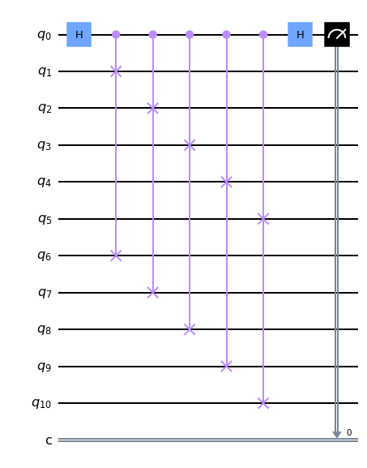

# SwapTest

## Overview

This repo contains a Jupyter notebook which implements the swap test on a simulated quantum computer using Qiskit. After reviewing the basics of state generation on a quantum computer, we use the swap test to not only distinguish our input state with another quantum state, but estimate the inner product in order to transform our input state into the target state. We do this for the case of an arbitrary single-qubit state, and extend it to a multi-qubit case in which each state takes the form of a bitstring (i.e. |01001>, |000>, etc.). 

This notebook provides basic plots and animations to showcase this circuit in action as well as its convergence properties. I've provided a conda environment file to take care of the dependencies.

## Installation

You'll need conda to create the provided environment. Assuming you have that installed, use `conda create env -f environment.yaml` to create the conda environment, `activate swap` to activate the environment, then go into Jupyter to launch the notebook. I provide more details on the implementation there. 

## Background

I run the risk of getting too deep into the weeds here, but I'll attempt to go through all the background necessary to understand what's going on in the swap test circuit, and my code. I'm assuming a baseline knowledge of quantum computing (i.e. what a qubit is, what a quantum circuit is, measurement, etc.) as well as some linear algebra. I'll include references at the end for further reading.

### Creating an arbitrary quantum state

We start with the ways in which you can represent a qubit. There are a few. 

Enter the Hilbert space, specify a basis {|0>, |1>}. Suppose you have a qubit in this space. It can be a superposition of the basis states: a|0> + b|1>. The weights of this superposition are complex numbers which satisfy the normalization condition |a|2 + |b|2 = 1. The modulus squared |x|2 of these weights represent the probability of observing the corresponding states in a measurement. Standard fare so far. 

With some algebra, however, this superposition can be restated as cos(θ/2)|0> + e(iφ)sin(θ/2)|1>, where 0 <= θ <= π and 0 <= φ <= 2π if you want to restrict yourself to unique states (φ = 0 and φ = 2π result in the same state, but let's, uh, let's ignore that). These angles are known as Bloch angles. Any state can be multiplied by a global phase factor eiγ without affecting measurement probabilities, so for our purposes we can ignore this phase. 

If you can parameterize the qubit with two angles, it isn't a big leap to visualize the state vector as lying on a sphere, the Bloch sphere. The states we truck with are restricted to the surface of this sphere (mixed states, those in a statistical ensemble, lie within the sphere, but we don't worry about those). 

(INSERT BLOCH SPHERE IMAGE)

The usage of Bloch angles to describe our states becomes useful when when considering unitary transformations of these states. The action of a unitary transformation can be interpreted as a rotation around the Bloch sphere with respect to some axis. An arbitrary unitary can be decomposed in any number of ways, about any axis going through the sphere, but the one that will be most useful for us is this one:

If we have a qubit in the state |0>, applying this transformation to the qubit will transform it into cos(θ/2)|0> + e(iφ)sin(θ/2)|1>, so this unitary is capable of getting us anywhere on the Bloch sphere. So for our purposes, we have a way of initializing our quantum state to any state we choose; all we have to do is specify θ and φ.

One final note before we continue. The above gate is not necessarily the one implemented on whatever physical quantum computer you use. Quantum computers have fundamental gate sets, a set of primitive gates that every gate in your program is transpiled to. While Qiskit gives us the u-gate built in, they have their own technique for initializing quantum states, given in [reference] (in their own words, they start with the target state and transform it to |0>, using the inverse transformation for the forward rotation).

### Distinguishing quantum states

The swap test was originally concieved by Buhrman et al. [reference] in a paper exploring how to effectively distinguish quantum states. In their paper they were concerned with distinguishing secret keys in the case where the keys are quantum states and the parties share no entanglement. They need to determine if their keys are the same, so they send copies of them to an arbiter. This arbiter then performs the swap test to check this, and informs the two parties of the result. They go on to give bounds on the qubits required for a given desired error. 

For this project, we are the arbiter. We're given two qubits, possibly many copies of each, and apply the following circuit:

In words, we apply the Hadamard gate to our ancilla, use the ancilla to control-swap our qubits, apply the Hadamard to the ancilla again, and finish by measuring the ancilla.  

If you work through the algebra (or read through Buhrman et al.) you'll find that the total state before measurement is (1/4)(|0>(|>|> + |>|>) + |1>(|>|> - |>|>)). The measurement probability for |1> is then 1/2(1 - |<|>|2. We can conclude a few things from this result. One, if the states are identical, the inner product is 1 and you will never measure the ancilla in the |1> state. On the other hand, if the states are distinct, there will be a nonzero probability of measuring |1>. While a single application of the test has a chance of failing, applying the test to multiple copies of our states gives us a high probability of correctly distinguishing them.

Furthermore, we can approximate the inner product with repeated applications of the swap test. If we apply the swap test N times, the inner product can be approximated as 1 - (2/N)*C, where C is the number of times the ancilla is observed in the |1> state across all applications of the test.

### Approximating a single-qubit state

Now we're posed a problem. Say we're given a state, any state. It's only one qubit, but it's in some random superposition of |0> and |1>. Furthermore, we have a qubit of our own that we'd like to transform into the state given to us. We don't know the superposition of the target state, but we can use the inner product approximation described in the previous section to do this.

The technique is as follows. We have multiple copies of our target qubit, and have the freedom to intialize our qubit to any other state on the Bloch sphere specified by Bloch angles (θ, φ). We start with our qubit as |0> and run the swap test several times with the unknown state. We then compute the inner product of the two states using our measurement results. While we might not know exactly how we need to modify θ and φ to get our state closer to the unknown state, we can perturb them in some direction. With our new values for the angles we run the swap test again, this time with our newly modified state. We continue in this fashion until the inner product of the two states is sufficiently close to 1. We then consider the process complete; we've approximated the unknown state in our own state. 

While it would be nice to use something like gradient descent to find the optimal angles, our lack of knowledge regarding the amplitudes in the unknown state prevents us from computing an explicit formula for the inner product. Therefore we cannot use it as a cost function for gradient descent. This doesn't mean we're completely lost; the approach I've described above (the random search) does not have to be a brute force search, but something like simulated annealing or some other global optimization technique. 

### More qubits, but simpler: approximating a product

We can extend the procedure described in the last section to the multi-qubit state case as well. If each qubit is specified by Bloch angles, 

## Further improvements

If you look at the notebook, you'll see that I accomplished the basic goals of this task.

1. Alternative methods of searching parameter space for the optimum
2. Applying this technique to a real quantum computer, with considerations for error
3. Implementing this circuit with PennyLane

## References

[1] 
[2] 
[3]
